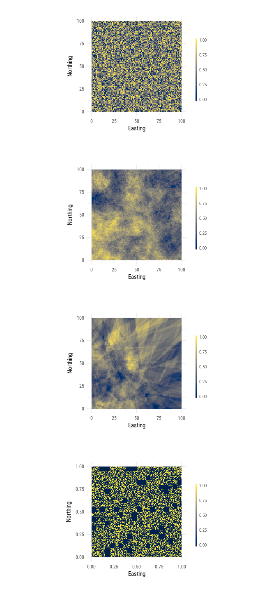


<!-- README.md is generated from README.Rmd. Please edit that file -->
cividis
=======

[](https://travis-ci.org/marcosci/cividis) [](https://codecov.io/gh/marcosci/cividis)

Jamie R. Nuñez, Christopher R. Anderton, and Ryan S. Renslow recently [introduced optimized color maps](https://arxiv.org/ftp/arxiv/papers/1712/1712.01662.pdf) for the scientific community. This so-called "cividis" colormap is generated by optimizing the ["viridis" colormap](https://bids.github.io/colormap/) and is optimal for viewing by those with or without color vision deficiency (CVD), a different visual perception of colors that affects 8.5% of the human population. It is designed to be perfectly perceptually-uniform, both in regular form and also when converted to black-and-white, and can be perceived by readers with all forms of color blindness. The cividis colormap was developed as a [Python module called "cmaputil"](https://github.com/pnnl/cmaputil).

Because of the high interest of the scientific community in R, we make this new colormap available for R!

This is how it looks like:


... and like this in action (coloring neutral landscape models from [NLMR](https://github.com/marcosci/NLMR)):



Installation
------------

To install the developmental version of `cividis`, use the following R code:

``` r
# install.packages("devtools")
devtools::install_github("marcosci/cividis")
```

Example
-------

This is a basic example which shows you how to solve a common problem:

``` r
## basic example code

# load packages
library(NLMR)
library(rasterVis)
library(cividis)

# simulate NLM
x <- nlm_random(ncol = 100,
                nrow = 100)

# plot it
gplot(x) +
 geom_tile(aes(fill = value)) +
 labs(x = "Easting",
      y = "Northing") +
 theme_nlm() +
 scale_fill_cividis(
    na.value = "transparent",
    name = "",
    guide = ggplot2::guide_colorbar(
      barheight = ggplot2::unit(40, units = "mm"),
      barwidth = ggplot2::unit(1, units = "mm"),
      draw.ulim = FALSE,
      title.hjust = 0.5,
      title.vjust = 1.5,
      label.hjust = 0.5
 )) -> p1
#> Scale for 'fill' is already present. Adding another scale for 'fill',
#> which will replace the existing scale.
```

Maintainer(s)
-------------

Marco Sciaini - \[@msciain\](<https://twitter.com/msciain>) - <sciaini.marco@gmail.com>

Author(s)
---------

Marco Sciaini - \[@msciain\](<https://twitter.com/msciain>) - <sciaini.marco@gmail.com>
Cédric Scherer - \[@CedScherer\](<https://twitter.com/CedScherer>) - <cedricphilippscherer@gmail.com>

References
----------

The colormap in the `cividis` package was [created](https://github.com/pnnl/cmaputil) and [published](https://arxiv.org/ftp/arxiv/papers/1712/1712.01662.pdf) by Jamie R. Nuñez and her colleagues.

The package is mainly a cheeky copy of the beautiful [`viridis` package for R](https://github.com/sjmgarnier/viridis) that was created by [Simon Garnier](https://twitter.com/sjmgarnier), [Noam Ross](https://twitter.com/noamross), and [Bob Rudis](https://twitter.com/hrbrmstr).
